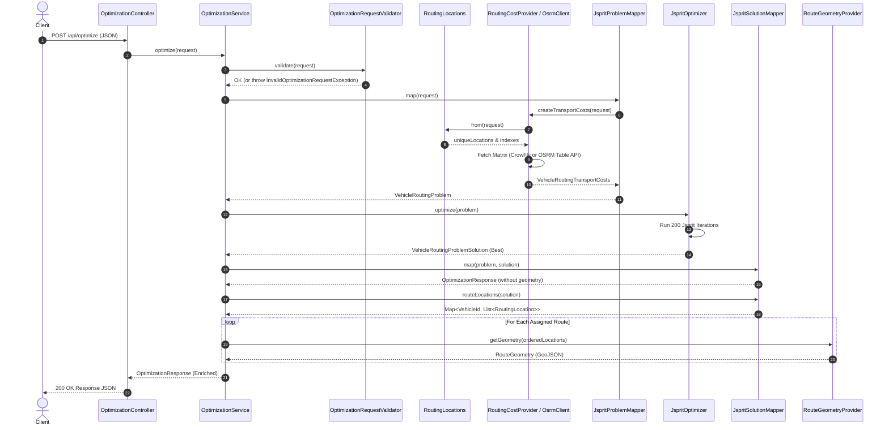

# 05. Architecture — High-Level & Detailed Design

This document describes the high-level system architecture and internal class relationships of the LinkedIT routing backend.

---

## 1. High-Level System Architecture

```mermaid
graph TD
    Client[React Frontend / HTTP Client] -->|POST /api/optimize| Controller[OptimizationController]
    Controller --> Service[OptimizationService]
    
    subgraph Spring Boot Backend
        Service --> Validator[OptimizationRequestValidator]
        Service --> CostProvider[RoutingCostProvider]
        Service --> ProbMapper[JspritProblemMapper]
        Service --> Optimizer[JspritOptimizer]
        Service --> SolMapper[JspritSolutionMapper]
        Service --> GeomProvider[RouteGeometryProvider]
    end
    
    subgraph Routing Cost Options
        CostProvider -->|routing.provider=crowfly| CrowFlyCost[CrowFlyRoutingCostProvider]
        CostProvider -->|routing.provider=osrm| OsrmCost[OsrmRoutingCostProvider]
        OsrmCost -->|Table API| OsrmClient[HttpOsrmClient]
    end
    
    subgraph Optimization Engine
        ProbMapper -->|VehicleRoutingProblem| Jsprit[jsprit-core Engine]
        Optimizer -->|searchSolutions| Jsprit
        SolMapper <--|VehicleRoutingProblemSolution| Jsprit
    end

    subgraph Geometry Providers
        GeomProvider -->|routing.provider=crowfly| CrowFlyGeom[CrowFlyRouteGeometryProvider]
        GeomProvider -->|routing.provider=osrm| OsrmGeom[OsrmRouteGeometryProvider]
        OsrmGeom -->|Route API| OsrmClient
    end
    
    subgraph External Infrastructure
        OsrmClient -->|HTTP GET /table/v1/driving| OSRM[OSRM Engine Server]
        OsrmClient -->|HTTP GET /route/v1/driving| OSRM
    end
```

---

## 2. Backend Component Layering

LinkedIT strictly follows clean architectural layering principles:

```text
               ┌──────────────────────────────────────────┐
               │         Presentation Layer               │
               │  - OptimizationController                │
               │  - ApiExceptionHandler                   │
               └────────────────────┬─────────────────────┘
                                    │
               ┌────────────────────▼─────────────────────┐
               │           Service Layer                  │
               │  - OptimizationService                   │
               │  - OptimizationRequestValidator          │
               └────────────────────┬─────────────────────┘
                                    │
               ┌────────────────────▼─────────────────────┐
               │          Optimization Layer              │
               │  - JspritProblemMapper                   │
               │  - JspritOptimizer                       │
               │  - JspritSolutionMapper                  │
               └──────────┬──────────────────────┬────────┘
                          │                      │
 ┌────────────────────────▼────────┐    ┌────────▼────────────────────────┐
 │      Routing & Cost Layer       │    │     Embedded Core Engine        │
 │  - RoutingCostProvider          │    │  - VehicleRoutingProblem        │
 │  - OsrmClient / HttpOsrmClient  │    │  - VehicleRoutingProblemSolution│
 │  - RouteGeometryProvider        │    │  - VehicleRoutingAlgorithm      │
 └─────────────────────────────────┘    └─────────────────────────────────┘
```

---

## 3. Dependency Direction Rules

1. **Strict One-Way Dependency**: `routing-backend` depends on `jsprit-core`. `jsprit-core` has **zero knowledge** of Spring Boot, OSRM, or HTTP APIs.
2. **Decoupled Cost Integration**: jsprit's `VehicleRoutingProblem` receives distance/time matrix calculations via the `VehicleRoutingTransportCosts` interface implemented in [`OsrmRoutingCostProvider.java`](file:///d:/Study/SIH/LinkedIT/routing-backend/src/main/java/com/linkedit/routing/routing/OsrmRoutingCostProvider.java#L28).
3. **Decoupled Geometry Generation**: Route polylines are generated **only after** optimization finishes, preventing unnecessary external OSRM Route calls during search.

---

## 4. Class Collaboration Diagram


