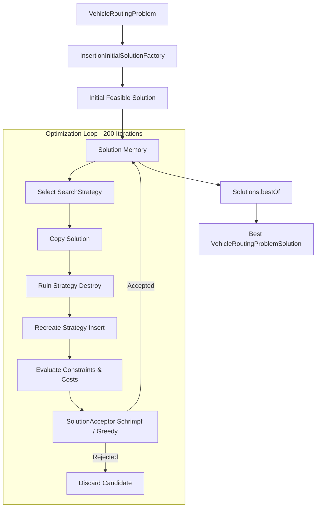
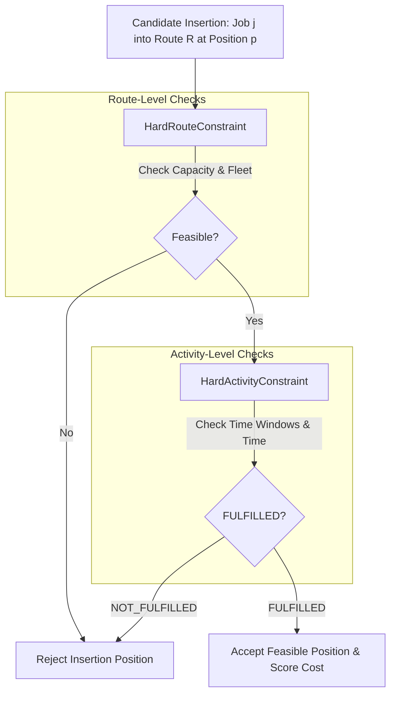

# 10. Algorithms Deep Dive — Vehicle Routing Optimization Mechanics

This document provides a comprehensive, source-code-level explanation of the vehicle routing optimization algorithms used in LinkedIT and implemented in `jsprit-core` (`[JSPRIT]`).

---

## 1. Mathematical Problem Formulation

### A. Conceptual Foundations (Beginner Explanation)

Before diving into optimization code, we define the mathematical components of a **Capacitated Vehicle Routing Problem with Time Windows (CVRPTW)**:

- **Central Depot**: $D = (x_0, y_0)$, the hub where vehicles start and finish routes.
- **Vehicle Fleet**: $V = \{v_1, v_2, \dots, v_K\}$, where each vehicle $v_k$ has a load capacity $C_k$, start location $S_k$, and end location $E_k$.
- **Delivery Jobs**: $J = \{j_1, j_2, \dots, j_N\}$, where each job $j_i$ has:
  - Location $(x_i, y_i)$
  - Quantity demand $d_i \ge 0$
  - Service unloading duration $s_i \ge 0$
  - Optional priority $p_i \in [1, 10]$
  - Optional time window $[tw_i^{start}, tw_i^{end}]$
- **Routes**: A route $R_k = (S_k, j_{\pi(1)}, j_{\pi(2)}, \dots, j_{\pi(m)}, E_k)$ is an ordered sequence of stops assigned to vehicle $v_k$.
- **Cost Matrix**: $c(a, b)$ defines the transport distance or travel time between locations $a$ and $b$.

---

### B. Mathematical Objective Function

#### 1. Simplified Theoretical Model
In academic literature, VRP minimizes total transport distance across all active routes:

$$\min \sum_{k=1}^{K} \sum_{i=0}^{m} c(R_k[i], R_k[i+1])$$

#### 2. Actual jsprit Source Code Objective Function
In the actual `jsprit-core` source code ([`SolutionCostCalculator.java`](file:///d:/Study/SIH/LinkedIT/jsprit-core/src/main/java/com/graphhopper/jsprit/core/problem/solution/SolutionCostCalculator.java)), the objective function is a rich multi-component cost calculation:

$$\text{Objective Cost} = \sum_{R \in \text{Routes}} \Big( f_{\text{fixed}}(R) + f_{\text{transport}}(R) + f_{\text{activity}}(R) \Big) + \sum_{j \in \text{Unassigned}} \text{Penalty}(j)$$

Where:
- $f_{\text{fixed}}(R)$: Fixed vehicle usage cost defined on `VehicleTypeImpl`.
- $f_{\text{transport}}(R)$: Sum of distance $\times$ `costPerDistance` ($0.001$ in [`JspritProblemMapper.java`](file:///d:/Study/SIH/LinkedIT/routing-backend/src/main/java/com/linkedit/routing/optimization/JspritProblemMapper.java#L37)).
- $f_{\text{activity}}(R)$: Service time and waiting time costs.
- $\text{Penalty}(j)$: Heavy mathematical cost penalty for leaving job $j$ unassigned.

---

## 2. What an Optimization Solution Is

An optimization solution is **not** merely finding a shortest path between two points.

```text
  INPUT DATA:
  Depot (0, 0)
  Vehicle V1 (Cap: 30)
  Vehicle V2 (Cap: 30)
  Jobs: A(demand:15), B(demand:20), C(demand:18), D(demand:10)

  OPTIMIZATION SOLUTION:
  Vehicle V1 Route:  Depot ──► Job A ──► Job B ──► Depot    (Total Load: 35 <= 50)
  Vehicle V2 Route:  Depot ──► Job C ──► Job D ──► Depot    (Total Load: 28 <= 50)
```

The optimizer determines:
1. Which jobs are assigned to which vehicles.
2. In what exact sequence each vehicle visits its assigned jobs.
3. How to satisfy all capacity, time window, and fleet constraints simultaneously.

---

## 3. Shortest Path vs OSRM Route vs jsprit Optimization

Understanding the boundaries between these three routing concepts is critical:

| Category | Input Parameters | Fundamental Question Asked | Responsible System |
| :--- | :--- | :--- | :--- |
| **Shortest Path** | Single Origin $A$, Single Destination $B$ | *"What is the shortest road path between $A$ and $B$?"* | Graph Algorithm (Dijkstra / A*) |
| **OSRM Route** | Ordered Stop Sequence $(A \to B \to C \to D)$ | *"What exact street polyline geometry connects this ordered sequence of stops?"* | **[OSRM]** Route API (`/route/v1/driving/...`) |
| **jsprit Optimization** | Fleet $V$, Jobs $J$, Capacities, Time Windows, Road Matrix | *"Which vehicle visits which jobs, in what order, satisfying all constraints, with minimum total cost?"* | **[JSPRIT]** Engine (`jsprit-core`) |

---

## 4. The Complete jsprit Optimization Pipeline

The execution flow inside `jsprit-core` when calling `algorithm.searchSolutions()`:



### Step-by-Step Code Execution Breakdown

1. **Problem Construction**: [`JspritProblemMapper.java`](file:///d:/Study/SIH/LinkedIT/routing-backend/src/main/java/com/linkedit/routing/optimization/JspritProblemMapper.java) builds `VehicleRoutingProblem`.
2. **Initial Solution Generation**: `InsertionInitialSolutionFactory` creates empty routes for vehicles and inserts jobs sequentially to build a starting feasible solution.
3. **Solution Memory**: The current best solution is saved in algorithm state.
4. **Strategy Selection**: `SearchStrategyManager` selects a `SearchStrategy` based on configured weights.
5. **Solution Deep Copy**: The current solution is copied before modification so ruined changes can be discarded if rejected.
6. **Ruin Phase**: `RuinStrategy` (e.g. `RuinRadial`, `RuinRandom`) removes a fraction of jobs from active routes.
7. **Recreate Phase**: `InsertionStrategy` (e.g. `RegretInsertion`, `BestInsertion`) re-inserts ruined jobs into feasible route positions.
8. **Constraint Evaluation**: `ConstraintManager` checks `HardRouteConstraint` and `HardActivityConstraint` rules.
9. **Cost Scoring**: `SolutionCostCalculator` calculates the new total objective cost.
10. **Acceptance Decision**: `SolutionAcceptor` (`SchrimpfAcceptance`) decides whether to accept or reject the candidate.
11. **Termination Check**: `JspritOptimizer` checks if iteration count has reached 200 (`DEVELOPMENT_ITERATIONS`).

---

## 5. Initial Solution Construction

Initial solution construction is performed by `InsertionInitialSolutionFactory`.

```text
  Empty Vehicle Routes:
  V1: Depot ──► Depot
  V2: Depot ──► Depot

  Job Queue: [Job A, Job B, Job C, Job D]

  Sequential Insertion:
  1. Insert Job A into V1  ──► V1: Depot -> A -> Depot
  2. Insert Job B into V1  ──► V1: Depot -> A -> B -> Depot
  3. Insert Job C into V2  ──► V2: Depot -> C -> Depot
  4. Insert Job D into V2  ──► V2: Depot -> C -> D -> Depot
```

If a job cannot be inserted into any vehicle route due to capacity or time window constraints, it is placed in the solution's `unassignedJobs` list. Unassigned jobs incur heavy objective cost penalties, signaling to subsequent Ruin & Recreate iterations that re-assigning them is top priority.

---

## 6. Ruin and Recreate Mechanics (Large Neighborhood Search)

### Intuition

Standard local search algorithms (like 2-opt or 3-opt swaps) swap adjacent stops. However, they easily get trapped in **local optima** (sub-optimal route arrangements where small tweaks fail to improve the cost).

**Ruin & Recreate** escapes local optima by temporarily destroying a significant portion of the solution and rebuilding it:

```text
  CURRENT ROUTE (Local Optimum):
  V1: Depot ──► A ──► B ──► C ──► D ──► Depot

  1. RUIN PHASE (Remove B and C):
  V1: Depot ──► A ──────► D ──► Depot    Unassigned: [B, C]

  2. RECREATE PHASE (Re-insert B and C using Regret Insertion):
  V1: Depot ──► B ──► A ──► C ──► D ──► Depot  (Cheaper Total Road Distance!)
```

By destroying 10%–30% of the route structure, the algorithm jumps to a completely different region of the search space.

---

## 7. Ruin Operators Present in `jsprit-core`

The embedded `jsprit-core` module (`com.graphhopper.jsprit.core.algorithm.ruin`) contains several ruin implementations:

| Ruin Strategy Class | Selection Mechanism | Neighborhood Purpose | Source File |
| :--- | :--- | :--- | :--- |
| `RuinRandom` | Selects $N$ jobs completely at random. | Provides unbiased exploration across the entire fleet. | [`RuinRandom.java`](file:///d:/Study/SIH/LinkedIT/jsprit-core/src/main/java/com/graphhopper/jsprit/core/algorithm/ruin/RuinRandom.java) |
| `RuinRadial` | Selects a target job and removes its $N$ closest spatial neighbors. | Destroys localized geographic route tangles. | [`RuinRadial.java`](file:///d:/Study/SIH/LinkedIT/jsprit-core/src/main/java/com/graphhopper/jsprit/core/algorithm/ruin/RuinRadial.java) |
| `RuinWorst` | Identifies jobs contributing the highest marginal transport cost and removes them. | Eliminates expensive detour stops. | [`RuinWorst.java`](file:///d:/Study/SIH/LinkedIT/jsprit-core/src/main/java/com/graphhopper/jsprit/core/algorithm/ruin/RuinWorst.java) |
| `RuinClusters` | Uses DBSCAN clustering (`DBSCANClusterer`) to destroy spatial customer clusters. | Re-balances multi-cluster vehicle routing. | [`RuinClusters.java`](file:///d:/Study/SIH/LinkedIT/jsprit-core/src/main/java/com/graphhopper/jsprit/core/algorithm/ruin/RuinClusters.java) |
| `RuinKruskalClusters` | Uses Minimum Spanning Trees (`KruskalClusterer`) to remove connected job trees. | Re-arranges tree-structured routes. | [`RuinKruskalClusters.java`](file:///d:/Study/SIH/LinkedIT/jsprit-core/src/main/java/com/graphhopper/jsprit/core/algorithm/ruin/RuinKruskalClusters.java) |
| `RuinString` | Removes contiguous sequences ("strings") of stops from vehicle routes. | Re-orders sub-tours between vehicles. | [`RuinString.java`](file:///d:/Study/SIH/LinkedIT/jsprit-core/src/main/java/com/graphhopper/jsprit/core/algorithm/ruin/RuinString.java) |
| `RuinTimeRelated` | Removes jobs occurring within the same time window interval. | Resolves time window congestion. | [`RuinTimeRelated.java`](file:///d:/Study/SIH/LinkedIT/jsprit-core/src/main/java/com/graphhopper/jsprit/core/algorithm/ruin/RuinTimeRelated.java) |

---

## 8. Recreate & Insertion Mechanics

During the Recreate phase, the algorithm evaluates candidate insertion positions for unassigned jobs:

```text
  Existing Route:  Depot ──► A ──► C ──► Depot
  Unassigned Job:  B

  Candidate Positions Evaluated:
  Position 0: Depot ──► [B] ──► A ──► C ──► Depot
  Position 1: Depot ──► A ──► [B] ──► C ──► Depot
  Position 2: Depot ──► A ──► C ──► [B] ──► Depot
```

For each candidate position, jsprit:
1. Verifies feasibility against all hard constraints.
2. Computes the **marginal insertion cost**.

---

## 9. Marginal Insertion Cost

When inserting job $B$ between stops $A$ and $C$, the marginal transport distance cost $\Delta c$ is:

$$\Delta c \approx c(A, B) + c(B, C) - c(A, C)$$

In `jsprit-core` ([`JobInsertionCostsCalculator.java`](file:///d:/Study/SIH/LinkedIT/jsprit-core/src/main/java/com/graphhopper/jsprit/core/algorithm/recreate/JobInsertionCostsCalculator.java)), marginal insertion cost also factors in:
- Vehicle capacity consumption.
- Waiting time introduced by time window bounds.
- Service duration delays propagated to subsequent stops.
- Soft constraint penalties.

---

## 10. Insertion Heuristics Comparison: Best vs Cheapest vs Regret

```text
                                  INSERTION STRATEGIES
                                           │
         ┌─────────────────────────────────┼─────────────────────────────────┐
         ▼                                 ▼                                 ▼
   BestInsertion                   CheapestInsertion                 RegretInsertion
 Evaluates best position          Inserts job with lowest           Calculates regret penalty
 for a single job                 global insertion cost             between 1st and 2nd best
                                  across all jobs                   positions (Prevents bottlenecking)
```

### A. Best Insertion (`BestInsertion.java`)
Selects a job and inserts it into its cheapest feasible position.

### B. Cheapest Insertion (`CheapestInsertion.java`)
Evaluates all unassigned jobs across all feasible positions and selects the single `(job, position)` pair with the absolute lowest insertion cost.

### C. Regret Insertion (`RegretInsertion.java`) — *Primary Strategy*

#### The Regret Intuition
Suppose we have two jobs waiting to be inserted:
- **Job X**: Best position cost $= 10$, 2nd-best position cost $= 12$. Regret $= 12 - 10 = \mathbf{2}$.
- **Job Y**: Best position cost $= 15$, 2nd-best position cost $= 85$. Regret $= 85 - 15 = \mathbf{70}$.

If we insert Job X first, Job Y might lose its only good position, forcing an $85$-cost insertion later.
**Regret Insertion inserts Job Y first** because delaying Job Y causes a massive penalty ($70$).

#### Mathematical Regret Formula
$$\text{Regret}_k(j) = \text{Cost}(j, \text{position}_k) - \text{Cost}(j, \text{position}_1)$$

In `jsprit-core`, [`RegretInsertionFast.java`](file:///d:/Study/SIH/LinkedIT/jsprit-core/src/main/java/com/graphhopper/jsprit/core/algorithm/recreate/RegretInsertionFast.java) calculates $k$-regret (typically $k=2$ or $k=3$) to prioritize bottleneck jobs.

---

## 11. Constraint Checking During Insertion

For every candidate insertion position, `ConstraintManager` ([`ConstraintManager.java`](file:///d:/Study/SIH/LinkedIT/jsprit-core/src/main/java/com/graphhopper/jsprit/core/problem/constraint/ConstraintManager.java)) evaluates constraints in hierarchical sequence:



### Constraint Return States
- `FULFILLED`: Insertion satisfies constraint.
- `NOT_FULFILLED`: Position violates constraint, evaluate next position.
- `NOT_FULFILLED_BREAK`: Position violates constraint and all subsequent positions in this route will also fail (short-circuits evaluation loop).

---

## 12. Capacity Algorithm Implementation

Capacity tracking is implemented in [`ServiceLoadRouteLevelConstraint.java`](file:///d:/Study/SIH/LinkedIT/jsprit-core/src/main/java/com/graphhopper/jsprit/core/problem/constraint/ServiceLoadRouteLevelConstraint.java) and [`ServiceLoadActivityLevelConstraint.java`](file:///d:/Study/SIH/LinkedIT/jsprit-core/src/main/java/com/linkedit/routing/optimization/JspritProblemMapper.java).

```text
  Vehicle Capacity = 50

  Stop 0 (Depot):     Load = 35 (Initial Load loaded at depot)
  Stop 1 (Deliver A): Unloads 18 ──► Remaining Load = 17
  Stop 2 (Deliver B): Unloads 17 ──► Remaining Load = 0
  Stop 3 (Depot):     Load = 0
```

1. Route-level constraint checks: $\text{Current Route Load} + \text{Job Demand} \le \text{Vehicle Capacity}$.
2. If total load $> 50$, insertion is immediately rejected (`NOT_FULFILLED`).

---

## 13. Time Window Algorithm Implementation

Time window constraints are implemented in [`VehicleDependentTimeWindowConstraints.java`](file:///d:/Study/SIH/LinkedIT/jsprit-core/src/main/java/com/graphhopper/jsprit/core/problem/constraint/VehicleDependentTimeWindowConstraints.java).

```text
  Customer Time Window: [3600s, 7200s]  (01:00 PM to 02:00 PM)

  Scenario A (Early Arrival at t = 3000s):
  - Vehicle arrives at 3000s (< 3600s).
  - Waiting Time = 3600 - 3000 = 600s.
  - Service Starts at 3600s.
  - Departure Time = 3600 + serviceDuration (240s) = 3840s. (FEASIBLE)

  Scenario B (Late Arrival at t = 7500s):
  - Vehicle arrives at 7500s (> 7200s).
  - Time window violated! (NOT_FULFILLED - REJECTED)
```

---

## 14. State Manager (`StateManager`)

Re-calculating route loads and arrival times from scratch during every candidate evaluation would be computationally expensive.

`StateManager` ([`StateManager.java`](file:///d:/Study/SIH/LinkedIT/jsprit-core/src/main/java/com/graphhopper/jsprit/core/algorithm/state/StateManager.java)) acts as a high-performance **memoization cache** that stores pre-calculated route state:
- Route load at start and end of route.
- Latest feasible arrival time at each activity.
- Cumulative travel distance and duration up to each stop.

When a job is removed or inserted, `StateManager` updates only the affected route segments.

---

## 15. Solution Acceptance Strategies

Once a candidate solution is generated by Ruin & Recreate, `SolutionAcceptor` decides whether to keep it:

```text
                     Candidate Solution Generated
                                  │
                                  ▼
                     Compare Objective Cost C_new vs C_current
                                  │
         ┌────────────────────────┴────────────────────────┐
         ▼                                                 ▼
   C_new < C_current                                C_new >= C_current
   (Cheaper Solution)                                (Worse Solution)
         │                                                 │
         ▼                                                 ▼
   ALWAYS ACCEPT                                 Check Schrimpf Threshold
                                                           │
                                          ┌────────────────┴────────────────┐
                                          ▼                                 ▼
                                   C_new - C_current <= Threshold   C_new - C_current > Threshold
                                          │                                 │
                                          ▼                                 ▼
                                       ACCEPT                            REJECT
```

### Supported Acceptance Strategies
1. **`SchrimpfAcceptance`**: Default acceptance strategy in `Jsprit.Builder`. Accepts worse solutions if the cost increase is within a decaying threshold $\alpha$, allowing the algorithm to escape local minima.
2. **`GreedyAcceptance`**: Only accepts strictly cheaper solutions ($C_{\text{new}} < C_{\text{current}}$). Fast, but vulnerable to local optima traps.

---

## 16. OSRM Matrix Integration & Algorithmic Performance

The architectural decision to precompute the OSRM matrix directly impacts algorithmic complexity:

```text
  WITHOUT MATRIX PRECOMPUTATION:
  200 iterations x 50 jobs x 10 positions = 100,000 evaluations
  100,000 evaluations x 20ms HTTP latency = 2,000 seconds (33 MINUTES!)

  WITH LINKED IT OSRM MATRIX PRECOMPUTATION:
  1 OSRM Table HTTP call = 200ms
  100,000 matrix array lookups in memory = 5ms
  Total Optimization Time = 205 milliseconds! (10,000x SPEEDUP)
```

---

## 17. Illustrative Worked Example: 5 Jobs & 2 Vehicles

> [!NOTE]
> **ILLUSTRATIVE EXAMPLE — NOT ACTUAL RUNTIME OUTPUT**

### Input Data
- Depot: $(20.2961, 85.8245)$
- Fleet: Vehicle `V1` (Cap: 30), Vehicle `V2` (Cap: 30)
- Jobs:
  - `J1`: Demand = 15
  - `J2`: Demand = 12
  - `J3`: Demand = 18
  - `J4`: Demand = 10
  - `J5`: Demand = 8

### Trace Execution
1. **Initial Solution**:
   - `V1`: Depot $\to$ `J1` (15) $\to$ `J2` (12) $\to$ Depot (Total Load: 27)
   - `V2`: Depot $\to$ `J3` (18) $\to$ `J4` (10) $\to$ Depot (Total Load: 28)
   - Unassigned: `[J5]` (Demand 8 cannot fit on V1 [27+8=35>30] or V2 [28+8=36>30]).
2. **Ruin Phase**: `RuinRadial` removes `J2` and `J4`.
3. **Recreate Phase**: `RegretInsertion` evaluates `[J2, J4, J5]`:
   - Calculates regret for `J5`: Inserting `J5` into `V2` after swapping `J4` gives feasible load $18 + 8 = 26 \le 30$.
   - Re-arranges routes:
     - `V1`: Depot $\to$ `J1` (15) $\to$ `J4` (10) $\to$ Depot (Total Load: 25 $\le$ 30)
     - `V2`: Depot $\to$ `J3` (18) $\to$ `J2` (12) $\to$ Depot (Total Load: 30 $\le$ 30)
   - `J5` inserted into `V1`: `V1` Load becomes $25 + 8 = 33 > 30$ (Rejected).
4. **Final Best Solution**:
   - `V1`: Depot $\to$ `J1` $\to$ `J4` $\to$ Depot
   - `V2`: Depot $\to$ `J3` $\to$ `J2` $\to$ Depot
   - Unassigned: `[J5]`

---

## 18. Algorithm Mapping Reference Table

| Optimization Concept | `jsprit-core` Source Class | Package Location |
| :--- | :--- | :--- |
| Problem Definition | `VehicleRoutingProblem` | `com.graphhopper.jsprit.core.problem` |
| Algorithm Builder | `Jsprit.Builder` | `com.graphhopper.jsprit.core.algorithm.box` |
| Master Search Execution | `VehicleRoutingAlgorithm` | `com.graphhopper.jsprit.core.algorithm` |
| Random Ruin | `RuinRandom` | `com.graphhopper.jsprit.core.algorithm.ruin` |
| Radial Ruin | `RuinRadial` | `com.graphhopper.jsprit.core.algorithm.ruin` |
| Worst Ruin | `RuinWorst` | `com.graphhopper.jsprit.core.algorithm.ruin` |
| Regret Insertion | `RegretInsertionFast` | `com.graphhopper.jsprit.core.algorithm.recreate` |
| Best Insertion | `BestInsertion` | `com.graphhopper.jsprit.core.algorithm.recreate` |
| State Memoization | `StateManager` | `com.graphhopper.jsprit.core.algorithm.state` |
| Constraint Manager | `ConstraintManager` | `com.graphhopper.jsprit.core.problem.constraint` |
| Acceptance Strategy | `SchrimpfAcceptance` | `com.graphhopper.jsprit.core.algorithm.acceptor` |
| Cost Calculator | `SolutionCostCalculator` | `com.graphhopper.jsprit.core.problem.solution` |
